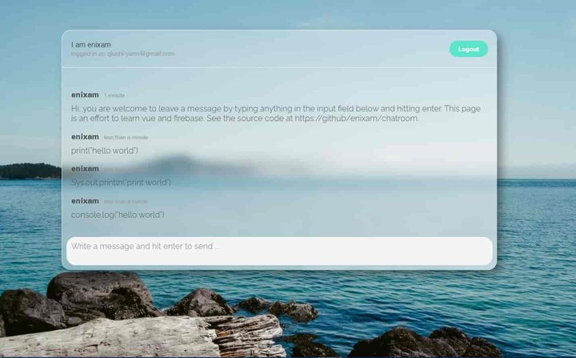

# web-projects

- [Vue](#Vue)

- [React](#React)

## React

### JavaScript Notebook 

An interactive notebook for JavaScript.

To use the app, run `npx javascript-notebook serve` and then navigate to https://localhost:3001

You can also install the package globally via

```
# npm
npm install -g javascript-notebook
# yarn
yarn global add javascript-notebook
```

For a quick preview, go to https://javascript-notebook.netlify.app/, where you can still code but not save to local files.


### Github Profile Viewer

'

[Site](https://gh-profile-viewer.netlify.app)

[Source](https://github.com/enixam/github-profile-viewer)

## Vue

### Data Science Shelf

[Data Science Shelf](https://dsbook-list.web.app/) is a simple web app for sharing good reads in data science. 


Users can 

- create, share and like book lists

- write list description and book review via Markdown Syntax

- filter lists based on categories, tags, or search term 

- view any user's profile 


Some features include 

- user authentication and file storage

- real-time updates and query

- markdown editor support 

- composition API 

[Site](https://dsbook-list.web.app/)

[Source](https://github.com/enixam/data-science-shelf)

### Minimal Chatroom

A minimal online chatroom, including realtime updates, authentication, and security rules, uses Glassmorphism UI. It's also my first attempt at [Github Actions](https://github.com/enixam/chatroom/actions?query=workflow%3A%22Deploy+with+Firebase%22)!  


<a href = "https://minimal-chatroom.web.app/">
  
</a>

[Site](https://minimal-chatroom.web.app)

[Source](https://github.com/enixam/chatroom)

### Reaction Timer

My first vue project. A simple yet fun app testing your reaction time. Happy clicking!


[Site](https://test-your-reaction.web.app)

[Source](https://github.com/enixam/reation-timer)
